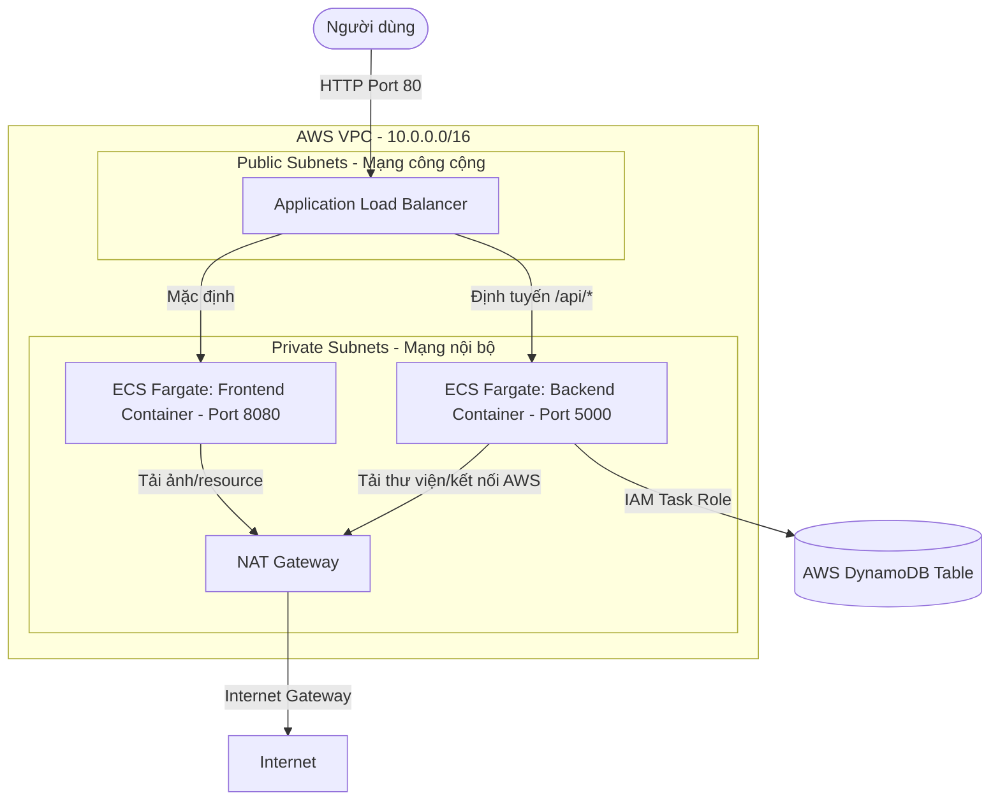

# AWS Microservice Task Manager

Dự án này là một ứng dụng Web Task Manager hoàn chỉnh được thiết kế theo kiến trúc Microservice 3 lớp (3-tier architecture) chuẩn doanh nghiệp, chạy hoàn toàn trên nền tảng đám mây AWS sử dụng hạ tầng không máy chủ (Serverless) nhằm tối ưu hoá chi phí và khả năng mở rộng.

---

## 1. Sơ Đồ Kiến Trúc Hệ Thống (Architecture)

Ứng dụng được triển khai trên AWS dựa trên mô hình bảo mật nhiều lớp:



### Điểm nổi bật về kiến trúc bảo mật & chi phí:
* **Mạng riêng tư (VPC)**: Các container chạy hoàn toàn trong **Private Subnets** (không có IP công khai), ngăn chặn mọi cuộc tấn công trực tiếp từ internet. Chỉ có Load Balancer (ALB) nằm ở **Public Subnets** mới có thể tiếp nhận và điều hướng traffic vào trong.
* **Security Group Chaining**: Container Backend và Frontend chỉ chấp nhận traffic được chuyển tiếp trực tiếp từ ALB Security Group.
* **Cơ sở dữ liệu serverless**: Sử dụng **AWS DynamoDB** giúp ứng dụng tự động mở rộng theo lượng người dùng và miễn phí 100% khi không có traffic (nằm trong Free Tier).
* **Cost Optimization**: Thiết lập chính sách tự hủy ECR image cũ (chỉ giữ 5 bản mới nhất) và giới hạn lưu trữ log CloudWatch trong 7 ngày để tránh phát sinh chi phí ngoài ý muốn.

---

## 2. Cấu Trúc Thư Mục Dự Án

```text
aws-microservice/
├── .github/workflows/
│   └── deploy.yml          # Pipeline CI/CD tự động của GitHub Actions (qua AWS OIDC)
├── backend/
│   ├── Dockerfile          # Multi-stage Dockerfile chạy Node-Alpine
│   ├── index.js            # Express API kết nối cơ sở dữ liệu DynamoDB
│   └── package.json        # Danh sách thư viện cần dùng (express, aws-sdk v3)
├── frontend/
│   ├── src/
│   │   └── App.js          # Giao diện người dùng React kết nối REST API backend
│   ├── Dockerfile          # Multi-stage Dockerfile sử dụng Nginx phục vụ web
│   └── package.json
├── terraform/              # Thư mục mã nguồn hạ tầng đám mây (IaC)
│   ├── alb.tf              # Load Balancer & luật định tuyến /api/*
│   ├── backend.tf          # Cấu hình Remote State lưu trữ hạ tầng trên S3 (mẫu)
│   ├── cloudwatch.tf       # Nơi quản lý và cấu hình log tập trung
│   ├── dynamodb.tf         # Khởi tạo cơ sở dữ liệu NoSQL Task
│   ├── ecr.tf              # Đăng ký nơi lưu trữ Docker images
│   ├── ecs.tf              # Khởi tạo Cluster, ECS Services, Task Definitions
│   ├── iam.tf              # Phân quyền Task Execution Role & Task Role (DynamoDB)
│   ├── outputs.tf          # Các giá trị đầu ra (DNS Link, ECR URL, v.v.)
│   ├── providers.tf        # Khai báo nhà cung cấp AWS
│   ├── security_groups.tf  # Tường lửa phân cấp cho ALB và ECS
│   ├── variables.tf        # Khai báo các biến cấu hình
│   └── terraform.tfvars    # Giá trị biến thực tế của môi trường phát triển
├── .dockerignore           # Chặn các file rác đẩy vào container
├── .gitignore              # Chặn file nhạy cảm (.env, tfstate) đẩy lên Git
├── deploy.sh               # Script tự động deploy nhanh cho Linux/macOS
├── deploy.ps1              # Script tự động deploy native cho Windows (PowerShell)
└── README.md               # Tài liệu này
```

---

## 3. Các Yêu Cầu Trước Khi Cài Đặt (Prerequisites)

Để vận hành dự án này ở local cũng như triển khai lên AWS, máy của bạn cần cài đặt sẵn:
1. **Git**
2. **Docker Desktop** (Đang chạy dịch vụ Docker daemon)
3. **AWS CLI** (Đã cấu hình quyền truy cập thông qua lệnh `aws configure`)
4. **Terraform** (Phiên bản `>= 1.0.0`)

---

## 4. Hướng Dẫn Chạy Thử Cục Bộ (Local Development)

Nếu muốn chạy thử nghiệm toàn bộ dự án dưới máy cá nhân trước khi đưa lên AWS:

### Bước 1: Khởi động Backend
1. Di chuyển vào thư mục backend và cài đặt thư viện:
   ```bash
   cd backend
   npm install
   ```
2. Chạy ứng dụng local:
   ```bash
   npm start
   ```
   *Mặc định backend sẽ chạy tại cổng `http://localhost:5000`.*

### Bước 2: Khởi động Frontend
1. Mở một terminal mới, chuyển vào thư mục frontend:
   ```bash
   cd frontend
   npm install
   ```
2. Khởi chạy React App:
   ```bash
   npm start
   ```
   *Mặc định giao diện React sẽ tự động mở tại địa chỉ `http://localhost:3000`.*

---

## 5. Hướng Dẫn Triển Khai Lên AWS (Deployment)

### Cách 1: Triển khai nhanh từ máy cá nhân bằng Script (Manual Deploy)

* **Dành cho Windows (PowerShell)**:
  1. Di chuyển vào thư mục `terraform/` và chạy hạ tầng:
     ```powershell
     cd terraform
     terraform init
     terraform apply -auto-approve
     cd ..
     ```
  2. Chạy script deploy để build & push Docker image:
     ```powershell
     powershell -ExecutionPolicy Bypass -File .\deploy.ps1
     ```

* **Dành cho Linux/macOS (Bash)**:
  1. Chạy hạ tầng:
     ```bash
     cd terraform && terraform init && terraform apply -auto-approve && cd ..
     ```
  2. Chạy script:
     ```bash
     chmod +x deploy.sh
     ./deploy.sh
     ```

*Sau khi deploy thành công, terminal sẽ in ra đường link ALB DNS để bạn kiểm tra ứng dụng.*

---

### Cách 2: Triển khai tự động hoàn toàn bằng GitHub Actions (CI/CD)

Dự án đã được cấu hình sẵn pipeline CI/CD tại file [.github/workflows/deploy.yml](file:///.github/workflows/deploy.yml) sử dụng cơ chế bảo mật **AWS OIDC**:

1. Đẩy dự án lên một repo GitHub cá nhân của bạn.
2. Lên AWS Console, cấu hình **IAM Identity Provider** liên kết với GitHub và tạo một **IAM Role** cấp quyền triển khai (ECR, ECS).
3. Copy **Role ARN** vừa tạo vào phần Secret của Repository GitHub với tên biến là `AWS_ROLE_TO_ASSUME`.
4. Mỗi khi bạn thực hiện thay đổi code và `git push` lên nhánh `main`, hệ thống sẽ tự động kích hoạt quá trình build Docker, push lên ECR và deploy trực tiếp lên AWS ECS Fargate mà không cần chạy bất kỳ lệnh nào từ máy cục bộ.
